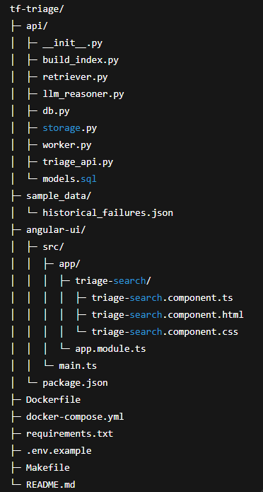

* Ready-to-run repo layout that uses FAISS HNSW for scalable approximate nearest-neighbor search, 
* supports incremental indexing (append-only), 
* stores metadata in Postgres, 
* uses Redis + RQ for background embedding & indexing jobs, 
* and includes a simple Angular UI for searching failures and sending feedback.

### Project folder tree (top-level)

<details>
tf-triage-scalable/
├─ api/
│  ├─ __init__.py
│  ├─ build_index.py
│  ├─ retriever.py
│  ├─ llm_reasoner.py
│  ├─ db.py
│  ├─ storage.py
│  ├─ worker.py
│  ├─ triage_api.py
│  └─ models.sql
├─ sample_data/
│  └─ historical_failures.json
├─ angular-ui/
│  ├─ src/
│  │  ├─ app/
│  │  │  ├─ triage-search/
│  │  │  │  ├─ triage-search.component.ts
│  │  │  │  ├─ triage-search.component.html
│  │  │  │  └─ triage-search.component.css
│  │  │  └─ app.module.ts
│  │  └─ main.ts
│  └─ package.json
├─ Dockerfile
├─ docker-compose.yml
├─ requirements.txt
├─ .env.example
├─ Makefile
└─ README.md
</details>

### Key design points (quick)
* FAISS index: IndexHNSWFlat (approx nearest neighbor, fast for millions)
* Index is appendable with ```index.add()``` and saved to disk; we maintain a mapping ```faiss_id -> failure_id``` in Postgres table faiss_map.
* Embeddings are computed in background using ```worker.py``` (RQ + Redis).
* ```build_index.py``` supports batching and rebuild; ```worker.py``` supports incremental append.
* UI is Angular-based simple app that calls API ```/search``` and ```/submit_failure``` and ```/feedback```.

### Files — API side (Python)
1. requirements.txt
2. .env.example
3. api/db.py: SQLAlchemy engine, and helper session factory + create tables.
4. api/build_index.py: Batch rebuild script (safe re-build) — uses IndexHNSWFlat and batching.
    - Note: ```build_index.py``` above batches embedding and maps FAISS internal id (sequential 0..N-1) to DB failure id in ```faiss_map```. 
    - It truncates and repopulates mapping table in a rebuild.
5. api/retriever.py: Search wrapper: loads HNSW index, encodes query, normalizes, sets efSearch for quality.
6. api/worker.py: RQ worker that computes embeddings for new failures and appends to index incrementally.
7. api/triage_api.py: FastAPI with endpoints: submit failure, search, rebuild index trigger, feedback.
8. api/storage.py: Simple persistence of triage results (example).

### Angular UI (simple)
1. angular-ui/package.json: Minimal to run dev server.
2. angular-ui/src/app/triage-search/triage-search.component.ts
3. angular-ui/src/app/triage-search/triage-search.component.html
4. angular-ui/src/app/triage-search/triage-search.component.css

### Docker & Compose
1. Dockerfile: Single image for API + worker code.
2. docker-compose.yml: Includes postgres, redis, api (web), worker, and index-builder init job (one-shot can be optionally used).
    - Note: index-builder is one-shot to prebuild a complete index. 
    - You can optionally start the stack without it and let the worker process unindexed rows.
3. Makefile

### quick-start
* TF Triage — HNSW + FastAPI + Postgres + Redis + Angular UI
1. copy `.env.example` -> `.env` and update keys (OPENAI_API_KEY optional)
2. Build images: ```make build```
3. Start services (detached): ```make up```
4. To build/rebuild index manually:```make index-rebuild```
5. 5. To process unindexed failures (one batch):```make index-worker```
5. Start Angular UI (optional):
    ```
    cd angular-ui
    npm install
    npm start
    ```
    * Visit `http://localhost:4200` (CORS may need to be handled if using different ports).

6. Submit a failure:
    ```
    curl -X POST http://localhost:8000/submit_failure
    -H "Content-Type: application/json" -d '{"error_log":"NullPointerException at PaymentService.validate()"}'
    ```
7. Search: ```curl "http://localhost:8000/search?q=NullPointerException&k=5"```

8. Trigger worker to index unindexed entries: ```make index-worker```


### Notes
- `build_index.py` performs a full rebuild (truncates and repopulates `faiss_map`).
- `worker.process_unindexed` appends new vectors and writes the index file (incremental).
- Use `HNSW` params `HNSW_M` and `HNSW_EFCONSTRUCTION` env vars to tune accuracy/perf.
- Monitor memory: HNSW increases memory with `M`. For millions of vectors, consider IVF+PQ or a managed vector DB.